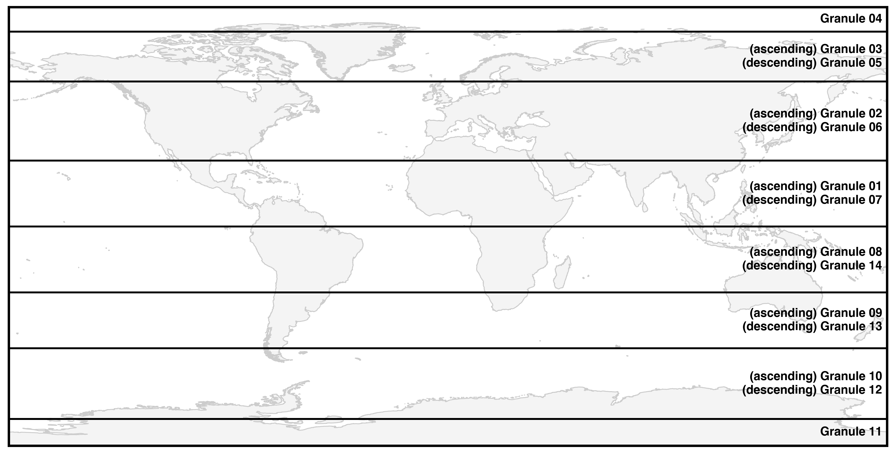

=============
read-ICESat-2
=============

|Language|
|License|
|PyPI Version|
|Documentation Status|
|Binder|
|Pangeo|
|zenodo|
|Shot Count|

.. |Language| image:: https://img.shields.io/pypi/pyversions/icesat2-toolkit?color=green
   :target: https://www.python.org/

.. |License| image:: https://img.shields.io/badge/license-MIT-green.svg
   :target: https://github.com/tsutterley/read-ICESat-2/blob/main/LICENSE

.. |PyPI Version| image:: https://img.shields.io/pypi/v/icesat2-toolkit.svg
   :target: https://pypi.python.org/pypi/icesat2-toolkit/

.. |Documentation Status| image:: https://readthedocs.org/projects/read-icesat-2/badge/?version=latest
   :target: https://read-icesat-2.readthedocs.io/en/latest/?badge=latest

.. |Binder| image:: https://mybinder.org/badge_logo.svg
   :target: https://mybinder.org/v2/gh/tsutterley/read-ICESat-2/main

.. |Pangeo| image:: https://img.shields.io/static/v1.svg?logo=Jupyter&label=PangeoBinderAWS&message=us-west-2&color=orange
   :target: https://aws-uswest2-binder.pangeo.io/v2/gh/tsutterley/read-ICESat-2/main?urlpath=lab

.. |zenodo| image:: https://zenodo.org/badge/193143942.svg
   :target: https://zenodo.org/badge/latestdoi/193143942

.. |Shot count| image:: https://img.shields.io/badge/dynamic/json?label=ICESat-2%20shot%20count&query=message&url=https%3A%2F%2Fraw.githubusercontent.com%2Ftsutterley%2Ftsutterley%2Fmaster%2FIS2-shot-count.json
   :target: https://icesat-2.gsfc.nasa.gov/

Python tools for obtaining and working with elevation data from the NASA ICESat-2 mission

- https://icesat-2.gsfc.nasa.gov
- https://icesat-2-scf.gsfc.nasa.gov
- https://nsidc.org/data/icesat-2/

ICESat-2 Data Products
######################

+-----------+------------------------------+-------------------------------------------+
|  Product  |             Name             |                Description                |
+===========+==============================+===========================================+
| **ATL00** | Telemetry Data               | Raw ATLAS telemetry in packet format      |
+-----------+------------------------------+-------------------------------------------+
| **ATL01** | Reformatted Telemetry        | Parsed, partially reformatted into HDF5,  |
|           |                              | generated daily, segmented into several   |
|           |                              | minute granules                           |
+-----------+------------------------------+-------------------------------------------+
| **ATL02** | Science Unit Converted       | Photon time of flight, corrected for      |
|           | Telemetry                    | instrument effects. Includes all photons, |
|           |                              | pointing data, spacecraft position,       |
|           |                              | housekeeping data, engineering data, and  |
|           |                              | raw atmospheric profiles, segmented into  |
|           |                              | several minute granules.                  |
+-----------+------------------------------+-------------------------------------------+
| **ATL03** | Global Geolocated Photon     | Precise latitude, longitude and elevation |
|           | Data                         | for every received photon, arranged by    |
|           |                              | beam in the along-track direction.        |
|           |                              | Photons classified by signal vs.          |
|           |                              | background, as well as by surface type    |
|           |                              | (land ice, sea ice, land, ocean),         |
|           |                              | including all geophysical corrections.    |
|           |                              | Segmented into several minute granules.   |
+-----------+------------------------------+-------------------------------------------+
| **ATL04** | Uncalibrated Backscatter     | Along-track atmospheric backscatter data, |
|           | Profiles                     | 25 times per second. Includes calibration |
|           |                              | coefficients for polar regions. Segmented |
|           |                              | into several minute granules.             |
+-----------+------------------------------+-------------------------------------------+
| **ATL06** | Land Ice Elevation           | Surface height for each beam with along-  |
|           |                              | and across-track slopes calculated for    |
|           |                              | each beam pair. Posted at 40 meters       |
|           |                              | along-track. Segmented into several       |
|           |                              | minute granules.                          |
+-----------+------------------------------+-------------------------------------------+
| **ATL07** | Arctic/Antarctic Sea Ice     | Height of sea ice and open water leads at |
|           | Elevation                    | varying length scale based on returned    |
|           |                              | photon rate for each beam presented       |
|           |                              | along-track. Segmented into several       |
|           |                              | minute granules.                          |
+-----------+------------------------------+-------------------------------------------+
| **ATL08** | Land Water Vegetation        | Height of ground including canopy surface |
|           | Elevation                    | posted at variable length scales relative |
|           |                              | to signal level, for each beam presented  |
|           |                              | along-track. Where data permits include   |
|           |                              | canopy height, canopy cover percentage,   |
|           |                              | surface slope and roughness, and apparent |
|           |                              | reflectance.                              |
+-----------+------------------------------+-------------------------------------------+
| **ATL09** | Calibrated Backscatter and   | Along-track cloud and other significant   |
|           | Cloud Characteristics        | atmosphere layer heights, blowing snow,   |
|           |                              | integrated backscatter, and optical       |
|           |                              | depth.                                    |
+-----------+------------------------------+-------------------------------------------+
| **ATL10** | Arctic/Antarctic Sea Ice     | Estimate of sea ice freeboard over        |
|           | Freeboard                    | specific spatial scales using all         |
|           |                              | available sea surface height              |
|           |                              | measurements. Contains statistics of sea  |
|           |                              | surface and sea ice heights.              |
+-----------+------------------------------+-------------------------------------------+
| **ATL11** | Antarctic/Greenland Ice      | Time series of height at points on the    |
|           | Sheet H(t) Series            | ice sheet, calculated based on repeat     |
|           |                              | tracks and/or cross-overs.                |
+-----------+------------------------------+-------------------------------------------+
| **ATL12** | Ocean Elevation              | Surface height at specific length scale.  |
+-----------+------------------------------+-------------------------------------------+
| **ATL13** | Inland Water Height          | Along-track inland and near shore water   |
|           |                              | surface height distribution within water  |
|           |                              | mask.                                     |
+-----------+------------------------------+-------------------------------------------+
| **ATL14** | Antarctic/Greenland Ice      | Height maps of each ice sheet for each    |
|           | Sheet H(t) Gridded           | year based on all available elevation     |
|           |                              | data.                                     |
+-----------+------------------------------+-------------------------------------------+
| **ATL15** | Antarctic/Greenland Ice      | Height change maps for each ice sheet,    |
|           | Sheet dh/dt Gridded          | for each mission year, and for the whole  |
|           |                              | mission.                                  |
+-----------+------------------------------+-------------------------------------------+
| **ATL16** | ATLAS Atmosphere Weekly      | Polar cloud fraction, blowing snow        |
|           |                              | frequency, ground detection frequency.    |
+-----------+------------------------------+-------------------------------------------+
| **ATL17** | ATLAS Atmosphere Monthly     | Polar cloud fraction, blowing snow        |
|           |                              | frequency, ground detection frequency.    |
+-----------+------------------------------+-------------------------------------------+
| **ATL18** | Land/Canopy Gridded          | Gridded ground surface height, canopy     |
|           |                              | height, and canopy cover estimates.       |
+-----------+------------------------------+-------------------------------------------+
| **ATL19** | Mean Sea Surface (MSS)       | Gridded ocean height product.             |
+-----------+------------------------------+-------------------------------------------+
| **ATL20** | Arctic/Antarctic Gridded Sea | Gridded sea ice freeboard.                |
|           | Ice Freeboard                |                                           |
+-----------+------------------------------+-------------------------------------------+
| **ATL21** | Arctic/Antarctic Gridded Sea | Gridded monthly sea surface height inside |
|           | Surface Height w/in Sea Ice  | the sea ice cover.                        |
+-----------+------------------------------+-------------------------------------------+

ICESat-2 Granules
#################

Each orbit of ICESat-2 data is broken up into 14 granules.
The granule boundaries limit the size of each ATL03 file and simplify the formation of higher level data products.

.. image:: ./icesat2_toolkit/data/ICESat-2_granules_polar.png
  :alt: ICESat-2 polar granules

Dependencies
############

 - `numpy: Scientific Computing Tools For Python <https://numpy.org>`_
 - `scipy: Scientific Tools for Python <https://docs.scipy.org/doc/>`_
 - `mpi4py: Python bindings of the Message Passing Interface (MPI) <https://mpi4py.readthedocs.io/en/stable/>`_
 - `h5py: Python interface for Hierarchal Data Format 5 (HDF5) <http://h5py.org>`_
 - `netCDF4: Python interface to the netCDF C library <https://unidata.github.io/netcdf4-python/>`_
 - `zarr: Chunked, compressed, N-dimensional arrays in Python <https://github.com/zarr-developers/zarr-python>`_
 - `pandas: Python Data Analysis Library <https://pandas.pydata.org/>`_
 - `scikit-learn: Machine Learning in Python <https://scikit-learn.org/stable/index.html>`_
 - `shapely: PostGIS-ish operations outside a database context for Python <http://toblerity.org/shapely/index.html>`_
 - `fiona: Python wrapper for vector data access functions from the OGR library <https://fiona.readthedocs.io/en/latest/manual.html>`_
 - `lxml: processing XML and HTML in Python <https://pypi.python.org/pypi/lxml>`_
 - `paramiko: Native Python SSHv2 protocol library <http://www.paramiko.org/>`_
 - `scp: scp module for paramiko <https://github.com/jbardin/scp.py>`_
 - `future: Compatibility layer between Python 2 and Python 3 <http://python-future.org/>`_
 - `yapc: Python version of the NASA Goddard Space Flight Center YAPC Program <https://github.com/tsutterley/yapc>`_

Download
########

| The program homepage is:
| https://github.com/tsutterley/read-icesat-2
| A zip archive of the latest version is available directly at:
| https://github.com/tsutterley/read-icesat-2/archive/main.zip

Disclaimer
##########

This project contains work and contributions from the `scientific community <./CONTRIBUTORS.rst>`_.
This program is not sponsored or maintained by the Universities Space Research Association (USRA) or NASA.
It is provided here for your convenience but *with no guarantees whatsoever*.

License
#######

The content of this project is licensed under the
`Creative Commons Attribution 4.0 Attribution license <https://creativecommons.org/licenses/by/4.0/>`_
and the source code is licensed under the `MIT license <LICENSE>`_.
